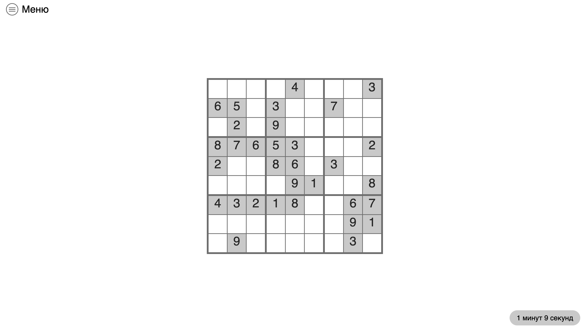
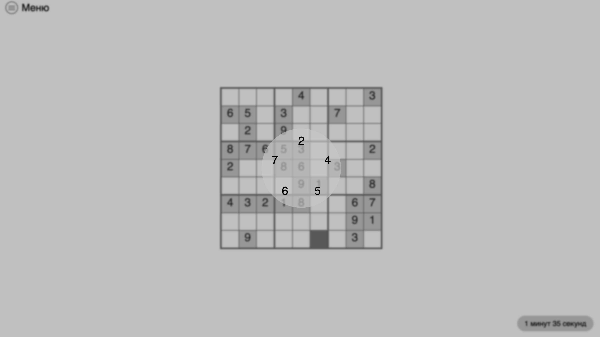
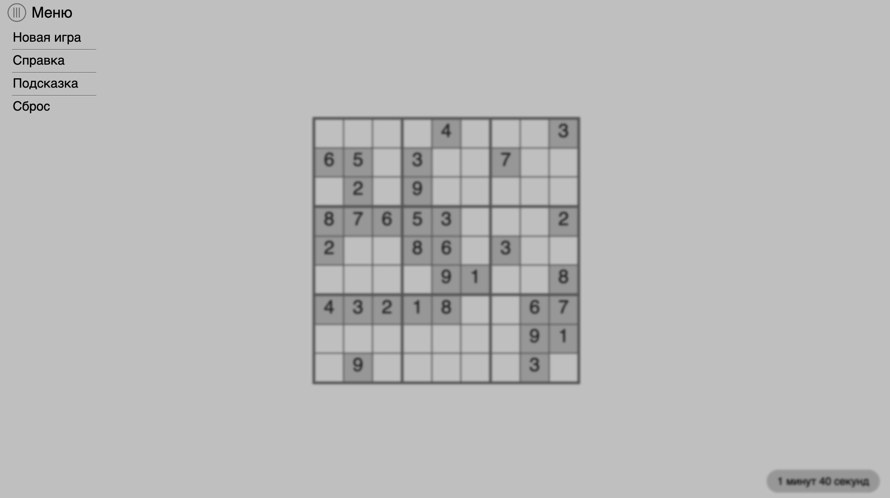
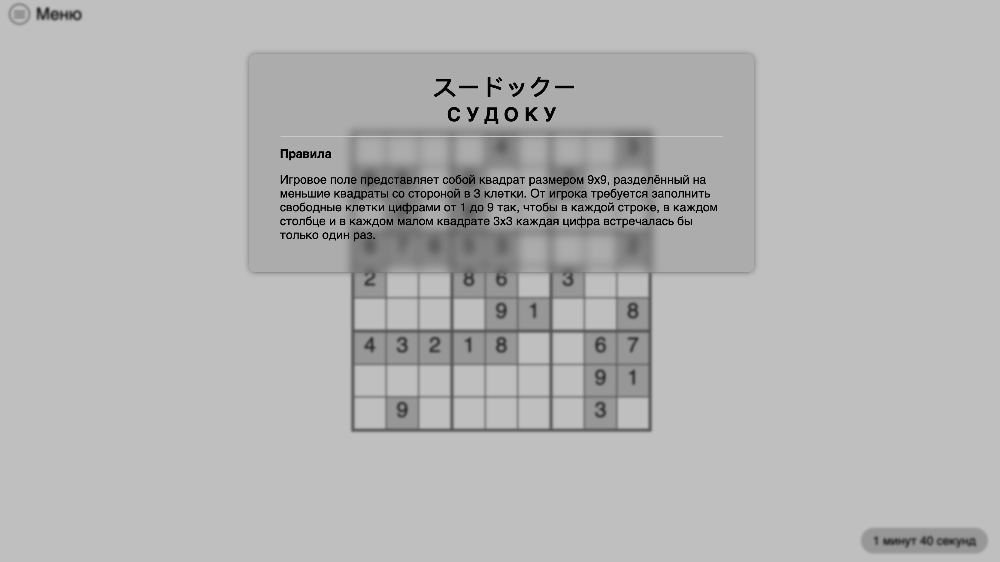

# Sudoku game
Simple pure js+html+css sudoku game

## Todo:
- [ ] Refract JS code (make classes, instead of bunch of functions)
- [ ] Fix timer bug (sometimes it shows random values)
- [ ] Span game grid in JS (instead of current hardcoded in HTML file)
- [ ] Add score table
- [ ] Maybe show all numbers in select circle (or add switch im menu)?
- [ ] Add several difficulties
